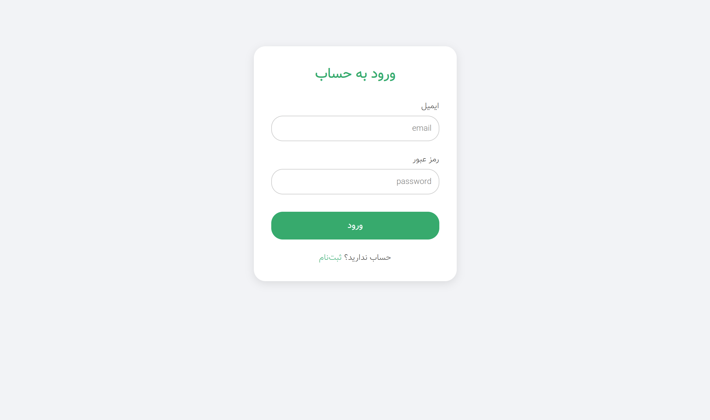

# 📝 Django Blog Project

A **full-featured blog application** built with **Django** and **PostgreSQL**, designed to showcase modern web development best practices.  
Includes authentication, role-based permissions, categories, tags, search, premium content, and a clean responsive UI.

---

## 🚀 Features

### 🧑‍💻 Authentication & Users
- Custom **User model** with extended fields
- Role-based access control:
  - **Superuser** – full access
  - **Admin** – manage author's posts
  - **Author** – create and manage blog posts
  - **User / Premium User** – comment, profile pictures, access premium content
- Login / Logout / Registration
- Premium subscription

### 📝 Blog Management
- Create, edit, delete posts
- Categories & tags
- Comment count on each post
- Pagination for post lists
- Search functionality

### 🎨 Frontend & UI
- Responsive design using HTML & CSS
- Highlighted layout for premium posts
- Narrow banner on top of the page
- Sidebar with search, categories, and tags

### ⚙️ Admin Panel
- Moderate posts and comments

---

## 📸 Screenshots

| Home Page | Post Detail | Login Page |
|----------|-------------|-----------|
|  |  |  |

---

## 🛠️ Tech Stack

- **Backend:** Python, Django, Django REST Framework
- **Database:** PostgreSQL
- **Frontend:** HTML, CSS, (JavaScript for interactivity)
- **Version Control:** Git, GitHub

---

## 📦 Installation & Setup

1. **Clone the repository**

```bash
git clone https://github.com/mr-dargi/djangoblog
cd djangoblog
```


2. **Create virtual environment & install dependencies**

```bash
python -m venv venv
source venv/bin/activate  # Linux/Mac
venv\Scripts\activate     # Windows

pip install -r requirements.txt
```


3. **Setup environment variables**

- Copy **.env-sample** to **.env**

- Fill in your **own values**:
    - **DJANGO_SECRET_KEY** → generate a random **secret key** (you can use Djanog secret key generator)

- **DATABASE_URL** → your **PostgreSQL** connection string

- **EMAIL_HOST**, **EMAIL_PORT**, **EMAIL_HOST_USER**, **EMAIL_HOST_PASSWORD** → your email settings

4. **Apply migrations & run server**

```bash
python manage.py migrate
python manage.py runserver
```

5. **Create superuser**

```bash
python manage.py createsuperuser
```

6. **Access the app**

Open your browser and go to:
http://127.0.0.1:8000/